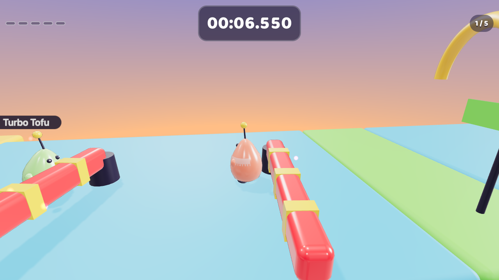
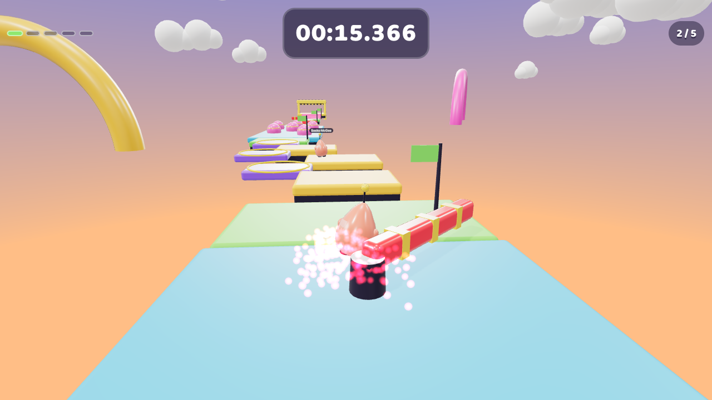
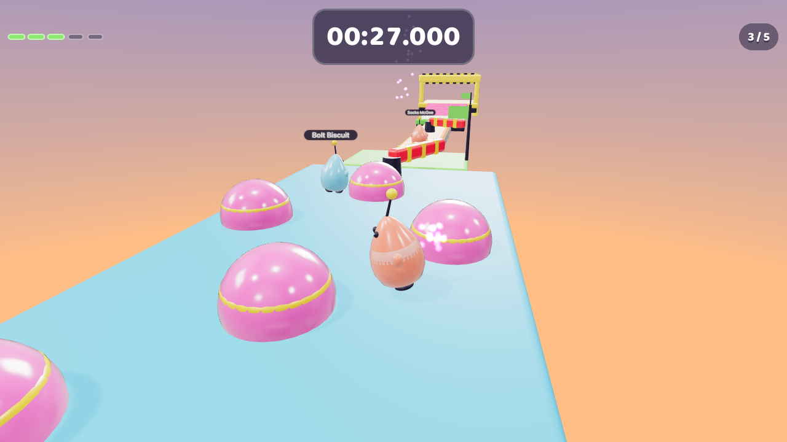
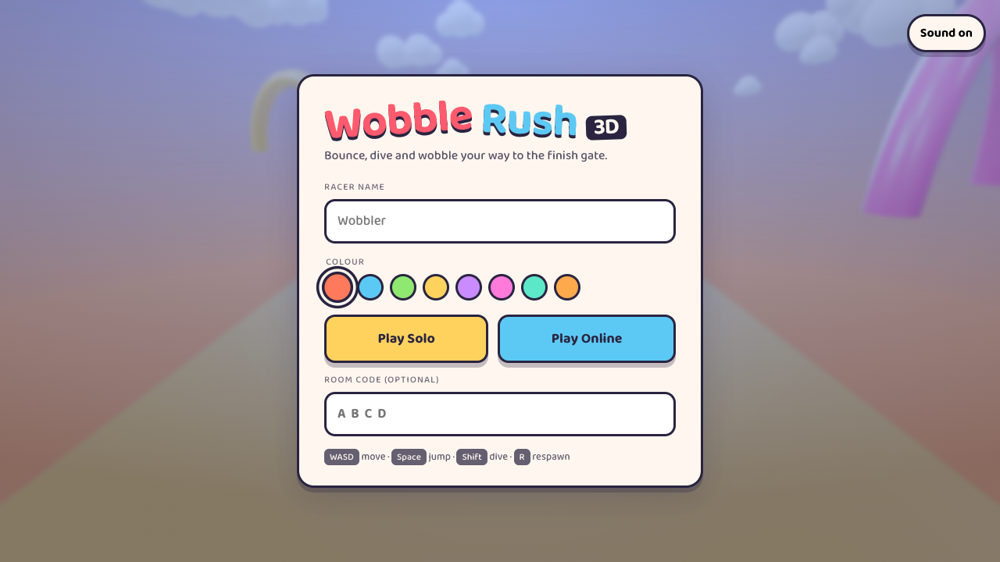
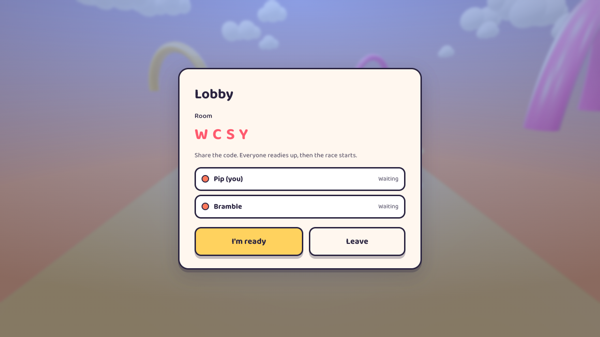

# Wobble Rush 3D

A bright, toy-like 3D obstacle-course racer that runs in the browser — single player against AI
racers, or online with friends in a shared lobby. Built with Three.js, TypeScript and Bun, and
deployed to Cloudflare Workers with multiplayer running on a Durable Object.

**▶ Play it: https://wobble-rush.mengmota.com**



Everything here is original: the course, the mascot, the palette and the art direction. No Fall
Guys assets, characters, names or trademarks are used or reproduced.

## What it is

You are Wobble, a chunky weeble with a spring-loaded antenna. Run the Sunrise Scramble: dodge
rotating sweeper bars, hop a chain of floating islands while sliding platforms sweep through the
gaps, bounce off a field of bumpers, cross a narrow bridge, and climb the final steps into the
finish gate. Fastest time wins.

| | |
|---|---|
|  |  |
|  |  |

## Demo recordings

Every clip below is a real recorded browser session driven by the scenario harness — no editing,
no sped-up footage.

| Scenario | Clip |
|---|---|
| Solo run, keyboard-driven | [`docs/media/demo-solo.mp4`](docs/media/demo-solo.mp4) |
| Fall, respawn at a checkpoint, finish, restart | [`docs/media/demo-respawn.mp4`](docs/media/demo-respawn.mp4) |
| AI racers running the course | [`docs/media/demo-npc.mp4`](docs/media/demo-npc.mp4) |
| Two players in one room — host view | [`docs/media/demo-multiplayer-host.mp4`](docs/media/demo-multiplayer-host.mp4) |
| Two players in one room — guest view | [`docs/media/demo-multiplayer-guest.mp4`](docs/media/demo-multiplayer-guest.mp4) |

## Features

- **One polished course** — start plaza, two sweeper lanes, a hop chain crossed by sliding
  platforms, a bumper field, a narrow bridge and a stepped climb into the finish gate.
- **Arcade movement, not a physics sim** — coyote time, jump buffering, variable jump height,
  a committed dive, and a knockback stumble you recover from quickly.
- **Five checkpoints** — fall off and you are back on the course in about a second.
- **NPC racers** — deterministic, seeded waypoint AI that reads the course, jumps gaps and
  lunges for the line. Every client in a party simulates an identical pack from the room seed,
  so the server never simulates a single NPC.
- **Online multiplayer** — create or join a 4-letter room, everyone readies up, a countdown
  starts the race, and positions stream over a WebSocket at 15 Hz with interpolation.
- **Original sound** — every cue is synthesised at runtime with WebAudio oscillators and noise
  buffers. No sampled assets, nothing to fail to download.
- **No silent fallbacks** — if the bundle, WebGL or a room fails, you get a readable error
  screen instead of a blank canvas.

## Controls

| Key | Action |
|---|---|
| `W` `A` `S` `D` / arrows | Move (camera-relative) |
| `Space` | Jump — hold for a full-height jump, tap for a short hop |
| `Shift` | Dive: a committed forward lunge |
| `R` | Respawn at your last checkpoint |
| Drag with the mouse | Orbit the camera |

## Architecture

```
src/shared/    pure, framework-free simulation — runs in the browser, in the Durable Object
               and under bun test with no DOM and no Three.js
  types.ts        the type contract: branded ids, course data, the WorldSnapshot seam
  constants.ts    every tunable in one place — the whole game feel is this file
  course.ts       the authored level
  player.ts       the fixed-step arcade controller
  collision.ts    sphere vs oriented box
  obstacles.ts    sweeper / mover / bumper kinematics as pure functions of time
  world.ts        assembles a course into a queryable, collidable snapshot
  npc.ts, rng.ts  seeded deterministic AI
  protocol.ts     Zod-validated wire messages
  room.ts         the lobby/race state machine — pure reducer, explicit effects

src/client/    Three.js rendering and the game shell (Game, LocalRunner, NpcPack,
               RemoteRunners, CourseView, RunnerView, Effects, AudioKit, Ui, ...)

src/server/    Hono worker + RoomDurableObject (WebSocket Hibernation API)
```

The simulation the tests exercise is the same code the browser runs. `Game` pumps a 60 Hz
fixed-step accumulator over `stepRunner`, and rendering only ever reads simulation state.

Multiplayer is client-authoritative for movement and server-authoritative for the lobby: the
Durable Object owns room phase, readiness and results, and relays positions. NPCs are derived
from the room seed on every client, so they cost the server nothing.

## Development

```bash
bun install
bun run dev        # build the client, then wrangler dev on http://localhost:8787
bun test           # the simulation, protocol and room state machine
bun run typecheck  # tsgo, client and worker configs
bun run lint       # biome
bun run build      # bundle the client into dist/
```

Requires Bun 1.4+.

## Testing and QA

Unit tests cover the physics, obstacle kinematics, collision resolution, checkpoint and respawn
logic, the NPC brain, the wire protocol and the room reducer.

Two harnesses back that up:

```bash
# Headless course tuning: run the AI pack over the whole course, no browser.
# If the AI cannot finish with a handful of falls, the course is unfair to humans too.
bun run scripts/qa/course-harness.ts 42 5

# Recorded browser scenarios, each asserting a binary observable.
bun run scripts/qa/demo.ts --scenario solo         # keyboard-driven run
bun run scripts/qa/demo.ts --scenario respawn      # fall, respawn, finish, restart
bun run scripts/qa/demo.ts --scenario npc          # AI racers on the course
bun run scripts/qa/demo.ts --scenario multiplayer  # two browsers in one room
bun run scripts/qa/demo.ts --scenario error        # bundle fails to load
```

`window.wobble` exposes a small inspection API (`state()`, `autopilot(bool)`) that the scenario
driver uses. Autopilot hands the local runner to the same NPC brain the AI racers use — it
drives the real simulation, so it cannot skip collision, checkpoints or the finish trigger.

## Deployment

```bash
bun run deploy     # builds and pushes to Cloudflare Workers
```

Static assets ship through the Workers assets binding; the room lives in a SQLite-backed Durable
Object; the public hostname is attached as a Cloudflare Custom Domain in `wrangler.jsonc`.

## Credits

Built with [oh-my-openagent](https://github.com/code-yeongyu/oh-my-openagent) (native version),
driven by **Opus 5** with **Kimi K3** subagents.

## License

MIT
